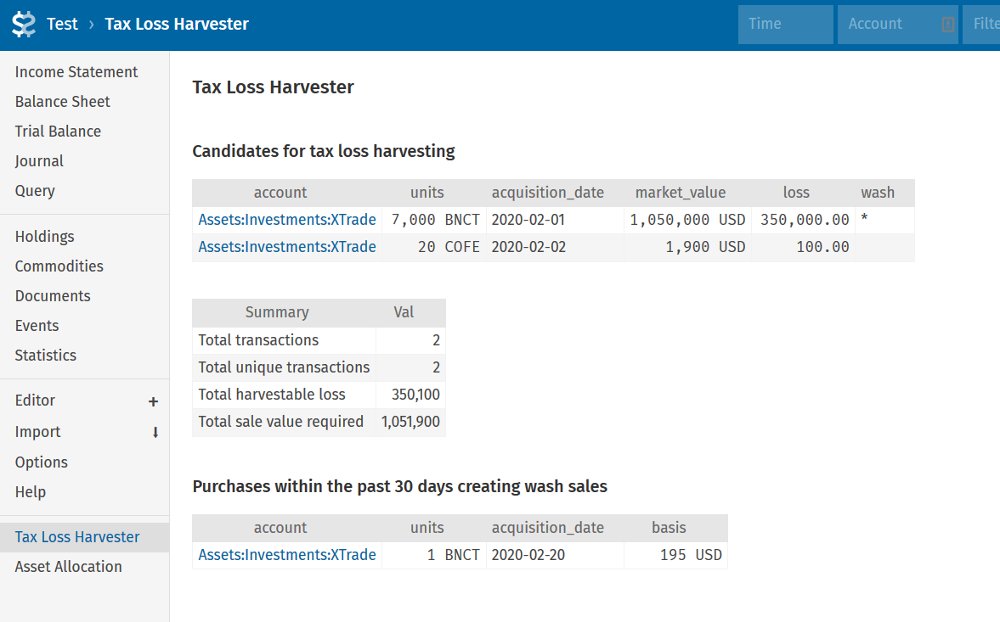

# fava_tax_loss_harvester
Tax loss harvester plugin for Fava (Beancount personal finance software).

Reports the set of lots that can be tax loss harvested from your beancount input file.
Includes a comprehensive wash sale report. Example:



The example above shows that 350,100 USD of losses can be harvested by selling the rows
listed. However, 1 BNCT of that would be considered a wash sale and will not be
allowable. It also shows the account and quantities of each commodity to sell total sale
proceeds (1,051,900 USD) if all the recommended lots were sold.


## Installation
Clone the source to a directory (eg: plugins/fava/tlh relative to your beancount
source).

Include this in your beancount source:

```2010-01-01 custom "fava-extension" "plugins.fava.tlh" ""```

## Configuration

Configure TLH through your beancount sources. Example:

```
2010-01-01 custom "fava-extension" "plugins.fava.tlh" "{
  'account_field': 'account',
  'accounts_pattern': 'Assets:Investments:Taxable',
  'loss_threshold': 50,
  'wash_pattern': 'Assets:Investments',
}"
```

### `account_field`
Default: LEAF(account)

This string is a part of the beancount query. If you want to see the entire account
name, set this to 'account'.

---

### `accounts_pattern`
Default: ''

Regex of the set of accounts to search over for tax loss harvesting opportunities.
This allows you to exclude your tax advantaged and other non-investment accounts.

---

### `loss_threshold`
Default: 1

Losses below this threshold will be ignored. Useful to filter out minor TLH
opportunities.

---

### `wash_pattern`
Default: ''

Regex of the set of accounts to search over for possible wash sales. This allows you to
include your tax advantaged and all investment accounts.

---


TODO:
- show if a loss generated would be long term or short term
